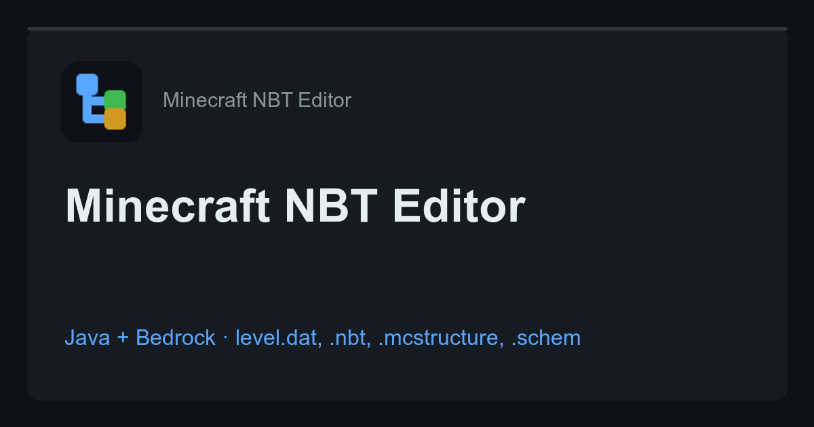

# Minecraft NBT Editor — Bedrock & Java

### ▶ [**Open the editor → w1zardz.github.io/bedrock-nbt-editor**](https://w1zardz.github.io/bedrock-nbt-editor/)

No install, no upload, no account — it runs in your browser, on desktop or phone.

[](https://w1zardz.github.io/bedrock-nbt-editor/)

Online NBT editor for **every** Minecraft edition and **every** server core — Bedrock (BDS, PocketMine-MP, Nukkit, PowerNukkitX, Cloudburst, Dragonfly, Endstone, LeviLamina, MCPE/MCBE) and Java (Vanilla, Paper, Spigot, Purpur, Folia, Fabric, Quilt, Forge, NeoForge, Mohist, Sponge and every obscure fork). Open a file, edit any tag, download it back in the exact same binary format. Runs entirely in the browser — no upload, no install, no account.

## Formats

| Format | Byte order | Root | Used by |
|---|---|---|---|
| `java` | big-endian | named | Vanilla, Paper, Spigot, Purpur, Folia, Fabric, Forge, NeoForge, Sponge |
| `java-network` | big-endian | nameless | Java 1.20.2+ protocol dumps |
| `bedrock-level` | little-endian + 8-byte header | named | Bedrock `level.dat`, BDS, PocketMine-MP, Nukkit, PowerNukkitX |
| `bedrock` | little-endian | named | `.mcstructure`, LevelDB values, Dragonfly, Cloudburst |
| `bedrock-network` | little-endian, varint ints | named | Bedrock protocol dumps, Geyser/Waterdog traffic |

Compression is sniffed and preserved: **gzip**, **zlib (deflate)** or raw, via the native Compression Streams API.

## Files it opens

`level.dat`, `level.dat_old`, `playerdata/<uuid>.dat`, `stats/*.json`-adjacent `.dat` files, `servers.dat`, `hotbar.nbt`, `idcounts.dat`, `raids.dat`, `map_*.dat`, structure `.nbt`, WorldEdit `.schem`, MCEdit `.schematic`, Bedrock `.mcstructure`, raw chunk payloads extracted from `.mca` regions or LevelDB, and packet dumps.

## Features

- Auto-detection of compression, byte order, header and root naming — no format dropdown before you can open a file
- All 13 tag types, 64-bit `TAG_Long` precision via `BigInt` (seeds and UUIDs survive a round trip)
- Java modified UTF-8 (CESU-8) strings encoded correctly; Bedrock standard UTF-8
- Lazy, paged tree — typed arrays for `TAG_Byte_Array` / `TAG_Int_Array` / `TAG_Long_Array`, so multi-megabyte chunk and structure NBT stays responsive
- Search by tag name or value with jump-to-tag
- Add, edit and remove tags anywhere in the tree
- SNBT export
- Format conversion: read Bedrock, write Java big-endian gzip, or the reverse
- Mobile-first UI, 44px tap targets, safe-area aware
- Zero dependencies, single static HTML file

## Scriptable API

The page exposes its engine on `window.NBT`, so it can be driven from the console or reused:

```js
const bytes = new Uint8Array(await file.arrayBuffer());

const { root, format, compression, headerVersion } = await NBT.read(bytes);
root.value.find(t => t.name === "LevelName").value = "New World";

const out = await NBT.write(root, format, { compression, headerVersion });

// other helpers
NBT.detectFormat(plainBytes);           // { formatId, result, exact }
NBT.serialize(root, "java", 8);         // Uint8Array, uncompressed
NBT.toSNBT(root, "");                   // SNBT text
```

Tag objects are plain: `{ type, name?, value, listType? }`. Arrays are `Int8Array` / `Int32Array` / `BigInt64Array`, longs are `BigInt`.

## Privacy

Files are read with `FileReader`, parsed in JavaScript and downloaded from an in-memory `Blob`. Nothing is transmitted anywhere; the page works offline once loaded.

## Site map

| Page | Targets |
|---|---|
| [`/`](https://w1zardz.github.io/bedrock-nbt-editor/) | The editor, every edition and file type |
| [`/level-dat-editor/`](https://w1zardz.github.io/bedrock-nbt-editor/level-dat-editor/) | World name, game mode, spawn, game rules |
| [`/java-nbt-editor/`](https://w1zardz.github.io/bedrock-nbt-editor/java-nbt-editor/) | Java Edition files and encoding |
| [`/mcpe-nbt-editor/`](https://w1zardz.github.io/bedrock-nbt-editor/mcpe-nbt-editor/) | MCPE, Pocket Edition, the 8-byte header |
| [`/pocketmine-nbt-editor/`](https://w1zardz.github.io/bedrock-nbt-editor/pocketmine-nbt-editor/) | PMMP, Nukkit, PowerNukkitX, BDS |
| [`/mcstructure-editor/`](https://w1zardz.github.io/bedrock-nbt-editor/mcstructure-editor/) | Bedrock structure files |
| [`/schematic-editor/`](https://w1zardz.github.io/bedrock-nbt-editor/schematic-editor/) | WorldEdit `.schem`, MCEdit `.schematic` |
| [`/playerdata-editor/`](https://w1zardz.github.io/bedrock-nbt-editor/playerdata-editor/) | Per-player `.dat` files |
| [`/nbt-viewer/`](https://w1zardz.github.io/bedrock-nbt-editor/nbt-viewer/) | Read-only inspection, SNBT export |
| [`/nbtexplorer-online/`](https://w1zardz.github.io/bedrock-nbt-editor/nbtexplorer-online/) | Comparison with the desktop tool |
| [`/nbt-format/`](https://w1zardz.github.io/bedrock-nbt-editor/nbt-format/) | Format reference: tags, encodings, bytes |
| [`/guides/…`](https://w1zardz.github.io/bedrock-nbt-editor/guides/change-world-name/) | Rename a world, fix a broken `level.dat`, edit game rules |

## Development

The site is static. Pages are generated from `tools/build.py`, which owns all page
content, the shared shell, structured data, `sitemap.xml`, `robots.txt` and `llms.txt`.
The editor itself lives in `assets/nbt.js` and `assets/app.css` and is written by hand.

```bash
python3 tools/build.py     # regenerate every page
bash tools/make-og.sh      # regenerate Open Graph cards (needs ImageMagick)
python3 -m http.server 4173
```

Open http://localhost:4173. Never edit a generated `index.html` directly — change
`tools/build.py` and rebuild.

## License

MIT — see [LICENSE](LICENSE). Not affiliated with Mojang or Microsoft.
